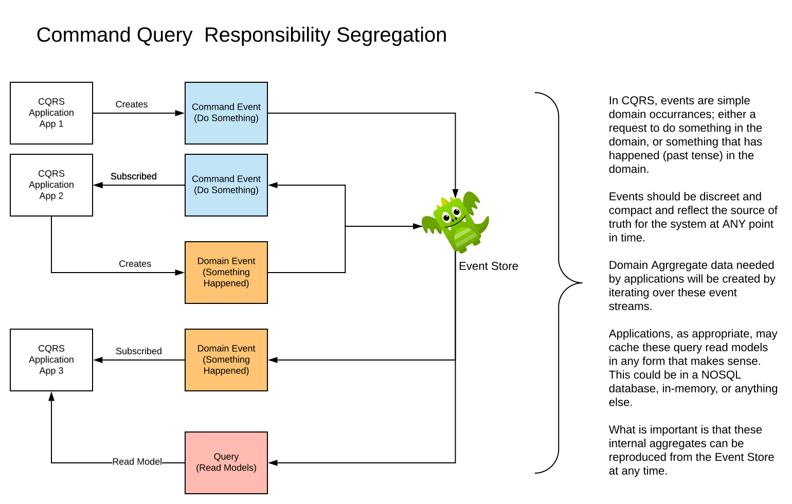

<p align="center">
  <a href="http://nestjs.com/" target="blank"></a>
</p>

[travis-image]: https://api.travis-ci.org/nestjs/nest.svg?branch=master
[travis-url]: https://travis-ci.org/nestjs/nest
[linux-image]: https://img.shields.io/travis/nestjs/nest/master.svg?label=linux
[linux-url]: https://travis-ci.org/nestjs/nest

  <p align="center">A progressive <a href="http://nodejs.org" target="blank">Node.js</a> framework for building efficient and scalable server-side applications, heavily inspired by <a href="https://angular.io" target="blank">Angular</a>.</p>
    <p align="center">
<a href="https://www.npmjs.com/~nestjscore"></a>
<a href="https://www.npmjs.com/~nestjscore"></a>
<a href="https://www.npmjs.com/~nestjscore"></a>
<a href="https://travis-ci.org/nestjs/nest"></a>
<a href="https://travis-ci.org/nestjs/nest"></a>
<a href="https://coveralls.io/github/nestjs/nest?branch=master"></a>
<a href="https://gitter.im/nestjs/nestjs?utm_source=badge&utm_medium=badge&utm_campaign=pr-badge&utm_content=body_badge"></a>
<a href="https://opencollective.com/nest#backer"></a>
<a href="https://opencollective.com/nest#sponsor"></a>
  <a href="https://paypal.me/kamilmysliwiec"></a>
  <a href="https://twitter.com/nestframework"></a>
</p>

## Description

[Nest](https://github.com/nestjs/nest) and [EventStore](https://eventstore.org) framework TypeScript starter repository with a simple _Todo_ application that will get you started building Event Sourced applications.

## Getting Started

### Intallation

**Note:** _This project uses a public github node module. Unfortunately, this requires you to login to npm with a personal access token. You can create one of these before starting._

1. Visit [Personal access tokens](https://github.com/settings/tokens)
2. Generate New Token
3. Select `repo`, `write:packages` and `read:packages`
4. Generate token

```bash
$ touch .env
$ docker-compose run app /bin/sh
/app # npm login
Username: <github username>
Password: <personal access token>
Email: (this IS public) <your github email>
Logged in as <github username> on https://registry.npmjs.org/.
/app # yarn install
/app # exit
$ docker-compose up
```

**Startup EventStore and Turn on Category Streams**

A _Category Stream_ is a special stream that represents all of the streams that share a specific pattern name. For our Todo example. You'll be creating streams with names like _todo-123_ and _todo-124_. The _Catefory Stream_ provides a stream of all events from streams that match _todo-<something else>_ and is call `$ce-todo`.

1. Start EventStore open [http://localhost:2113](http://localhost:2113) in your browser
2. Use the default username and password: `admin`, `changeit`
3. Visit the [Projections](http://localhost:2113/web/index.html#/projections) page
4. Select `$by-category` and click on `Start` once you are there.

Now you should be able to subecribe to events from the `$ce-todo` stream.

### Running the app

By default the application is run in `debug` mode using `yarn start:debug`. This enables remote debugging from `vscode` or your browser. `watch` mode is also turned on for incremental updates while you work on the project. Other options can be found in `package.json`

## Test

You'll find the usual test suite, though nothing has been done to provide tests for this example. This could be an area for exploration once you've got things working.

```bash
# unit tests
$ npm run test

# e2e tests
$ npm run test:e2e

# test coverage
$ npm run test:cov
```

## Working with the App

The application is an Event Sourcing application setup to work using CQRS, or Command Query Response Segregation. This generally means, that Command Events are distinct from Queries. It is also setup to enable direct interactions with EventStore.

<p align="center">
  <a href="doc/CQRS.svg" target="blank"></a>
</p>

The goal of this project is to provide a basic pattern for `creating`, `publishing`, `subscribing` to and `handling` events. Setting this up is pretty straightforward.

1. Create your event data structure as a `DTO`, or Data Transfer Object
1. Add an Event Implementation
1. Add an Event Handler
1. Configure the app to connect to EventStore

The starter code for this application models a _Todo List_ with a single event type, `TodoItemAddedEvent`, which gets generated when an _item_ is added to a _Todo Event Stream_. The application then subscribes to all `TodoAddedEvent`s by using a `catch-up` subscription to an EventStore `category` stream, where each stream is identified by `todo-<some id>`

<p align="center">
  <a href="doc/ES-Worksho\ App.svg" target="blank"></a>
</p>

### Create the Event Data

Before doing anything else, we'll need data to represent the events that occur on a stream. In general event data, should be simple and should not be redundant (think database 3rd normal form). Our starter code offers a single event data, `TodoItemData`. Given the simplicity of the data structure, the code is organized in a single file to hold all of the DTOs the the _Todo Module_ amd is found in `tod/event-tdos.ts`. If this gets to be large or complex, you may consider reorganizing the code.

```typescript
/* tslint:disable */

export class TodoItemData {
  value: string
}
```

Nothing complex, simply a class with `string` single value. Add other events here, or consider breaking up your DTOs into separate files while including validators etc.

### Create Events and Handlers

Interacting with the event store will mean that your are _publishing_, or _receiving_ events on the `EventBus`. There are three buses: `CommandBus`, `QueryBus` and `EventBus`. We're keeping it simple, so we're only using the `EventBus`. The other buses are identical, but used for _commands_ and _queries_, respectively.

Each bus has a corresponding directory tree under the `cqrs` directory. If your application is complex and has several _modules_ and many events, you may want to organize your event data by _module_.

Our event code is all found under `cqrs/events`. Here, you'll find the `handler` directory for _event handlers_ that get called when your _event subscription_ receives data and the `impl` directory with the implementation code for each event type. Note the `index.ts` setup to simplify inclusion of these events and handlers.

Our very simple event looks like this

```typescript
// cqrs/events/impl/todo-item-added-event.ts
import { IEvent } from '@nestjs/cqrs'
import { TodoItemData } from '../../../todo/event-dtos'
import { Logger } from '@nestjs/common'

export class TodoItemAddedEvent implements IEvent {
  constructor(
    public readonly _id: string,
    public readonly toDoItemAddeddDto: TodoItemData,
  ) {
    Logger.log(`TodoItemAdded Constructor: ${toDoItemAddeddDto} for id ${_id}`)
  }
}
```

**Note** that we've added an `_id` to use in order to identify the _stream id_ for an event instance, followed by the DTO data for the event. Its as simple as that. You may want to consider more complex meta data, but the approach would be the same. _(We may also consider upgrading the framework to include the meta data for events as well)_

The handler boilerplate looks like this...

```
// cqrs/events/handler/todo-item-added-handler.ts

import { Logger } from '@nestjs/common'
import { EventsHandler, IEventHandler } from '@nestjs/cqrs'
import { TodoItemAddedEvent } from '../impl'

@EventsHandler(TodoItemAddedEvent)
export class TodoItemAddedHandler implements IEventHandler<TodoItemAddedEvent> {
  handle(event: TodoItemAddedEvent): any {
    Logger.log(event, 'TodoItemAddedHandler: ')
  }
}
```

### Initialize the EventBus

Now that you can create events and handler events, they need to be hooked into _EventStore_ and the _EventBus_. This is done in `event-bus.provider.ts`. The code here is used to setup subscriptions and map them to Events. This is where handlers are setup to be called when the subscribed events are received.

In this code, we've setup a `catch-up` subscription that subscribes to the `TodoItemAddedEvent`.

```typescript
import { Logger } from '@nestjs/common'
import {
  EventStoreBusConfig,
  EventStoreSubscriptionType,
} from '@wisersolutions/nestjs-eventstore'

import { TodoItemData } from './todo/event-dtos'
import { TodoItemAddedEvent } from './cqrs'

export const eventStoreBusConfig: EventStoreBusConfig = {
  subscriptions: [
    {
      type: EventStoreSubscriptionType.CatchUp,
      stream: '$ce-todo',
      startFrom: 0, // Catch up from the very first event
    },
  ],
  eventInstantiators: {
    TodoItemAddedEvent: (
      _id: string,
      data: TodoItemData,
    ): TodoItemAddedEvent => {
      Logger.log('Received TodoItemAddedEvent')
      return new TodoItemAddedEvent(_id, data)
    },
  },
}
```

**Note:** At present _catch up_ will always catch up from the very first event in the stream each time the service is started. The `startFrom` key could be modified to use some other event number if you needed to start from somewhere else as may be wanted on a restart.

### Initialize the Application Module

The last piece of setup is to initialize _EventStore_ for the application. This is done in `app.module.ts`

In this code, we're initializing using the `EentStoreCqrsModule` and getting configuration from the `ConfigService` service and the `eventStoreBusConfig`. Note the addition of the `TodDoModule` where our controller and service code exists to manage ToDo lists.

```typescript
import * as path from 'path'
import { Module } from '@nestjs/common'
import { AppController } from './app.controller'
import { AppService } from './app.service'
import { EventStoreCqrsModule } from '@wisersolutions/nestjs-eventstore'
import { TodoModule } from './todo/todo.module'
import { ConfigModule, ConfigService } from 'nestjs-config'
import { eventStoreBusConfig } from './event-bus.provider'

@Module({
  imports: [
    ConfigModule.load(path.resolve(__dirname, 'config', '**/!(*.d).{ts,js}')),
    EventStoreCqrsModule.forRootAsync(
      {
        useFactory: async (config: ConfigService) => {
          return {
            connectionSettings: config.get('eventstore.connectionSettings'),
            endpoint: config.get('eventstore.tcpEndpoint'),
          }
        },
        inject: [ConfigService],
      },
      eventStoreBusConfig,
    ),
    TodoModule,
  ],
  controllers: [AppController],
  providers: [AppService],
})
export class AppModule {}
```

### Publishing Events

This example application lets you publish your Todo Items through a REST interface. Adding items is done through a `Post` to `/todo/:id` that is implemented in the `TodoController` which goes on to call the `addItem` method of the `TodoService`.

Publishing is quite simple and is done with the following code (found in `todo-service.ts`)

```typescript
this.eventBus.publish(
  new TodoItemAddedEvent(stream, addItemDto),
  `todo-${stream}`,
)
```

Where the `publish` method, takes two arguments: the event data and the name of the stream the data should be published to.

To use the `Post`, try the following:

```bash
$ curl --header "Content-Type: application/json" \
  --request POST \
  --data '{"value":"Learn about EventStore"}' \
  http://localhost:3000/todo/1
```

This should result in log output similar to...

```bash
app_1          | [Nest] 64   - 04/02/2020, 11:05:03 AM   addItem for todo list: 1 +535980ms
app_1          | [Nest] 64   - 04/02/2020, 11:05:03 AM   TodoItemAdded Constructor: [object Object] for id 1 +2ms
app_1          | [Nest] 64   - 04/02/2020, 11:05:04 AM   Received TodoItemAddedEvent +41ms
app_1          | [Nest] 64   - 04/02/2020, 11:05:04 AM   TodoItemAdded Constructor: [object Object] for id 1 +3ms
app_1          | [Nest] 64   - 04/02/2020, 11:05:04 AM   [TodoItemAddedHandler: ] Object:
app_1          | {
app_1          |   "_id": "1",
app_1          |   "toDoItemAddeddDto": {
app_1          |     "value": "Learn about EventStore"
app_1          |   }
app_1          | }
```

### Retrieving Events etc.

The `TodoController`s REST interface offers two routes `GET /todo` which lists all existing (or at most 1000) items and `GET /todo/:id` which will list the items from the stream with the supplied `id`.

The code that does all of the lifting is as follows...

```typescript
async findItems(
    streamName: string,
    start: number,
    pageSize: number,
  ): Promise<string[]> {
    let result: string[]

    const eventSlice = await this.eventStore.connection.readStreamEventsForward(
      streamName,
      start,
      pageSize,
      true,
    )

    result = eventSlice.events.map((v, i, a) => {
      const data: TodoItemAddedEvent = JSON.parse(
        v.event.data.toString(),
      ) as TodoItemAddedEvent
      return data.toDoItemAddeddDto.value
    })
    return result
  }
```

This is pretty boilerplate EventStore code where a stream is read with a starting point and a maximum number of events to return (as `pageSize`). Once the events have been returned, they are mapped to a `string[]`. Note how the event data is converted to `string` and parsed as JSON to deliver a `TodoItemAddedEvent`.

## What's Next?

Play with the application; there's a lot more you can do to build on this basic application. Note how the `EventStore` instance is injected into `TodoService` and how it is used to access the EventStore Connection via `this.eventStore.connection`. This class comes from the [node-event-store-client](https://github.com/nicdex/node-eventstore-client#readme) which you can refer to for other things you'd like to do.

Other things to try:

- Play around with the _EventStore_ console
- Consider a capability to remove items and how that might effect the design
- Consider a done status for Todo Items
- Consider receiving _Command_ events to perform the tasks that the REST endpoints are doing. You can generate these events through _Postman_ or _Insomnia_ or even _curl_
- Consider a competing subscription pattern where your service is cooperating with other workloads to work on an event stream. Use _Persisten Subscriptions_ for this

## License

Nest is [MIT licensed](LICENSE).
